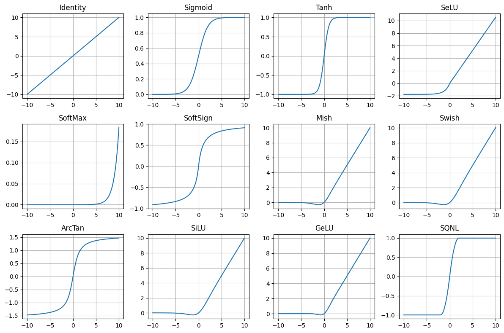

# Essential PyTorch to build like a researcher

*This is an original piece. All learnings were hard earned. I only used an LLM to help me codify my intuition into logic and refine my voice*

## Summary (tldr)

This post is a focused tour of the 20% of PyTorch you actually use 80% of the time when building real models from scratch. Instead of covering the whole library, I walk through the core tensor patterns (shapes like `(B, C, H, W)` and `(B, L, D)`), the small set of shape ops you’ll keep reaching for (`flatten`, `transpose`, `view`, `expand`, etc.), and the essential modules (`nn.Module`, `Linear`, `Conv2d`, `Sequential`, learned embeddings, positional encodings). Along the way, I show how these pieces wire together in concrete examples like tokenizing images into patches, adding positional embeddings via broadcasting, and building patch embedding layers. The goal is simple: if you deeply understand everything in this article and practice with dummy tensors, you’ll be able to read and implement modern architectures (CNNs, transformers, UNets, VAEs, diffusion-style models) without being intimidated by PyTorch’s API surface.

I highly encourage you to watch one of my implementation videos to see exactly everything in this article

Implementing CLIP from scratch in PyTorch
https://youtu.be/isNBYn_mvI0

## The goal

The goal of this article is to reduce the intimidation of PyTorch — to get you to think, “Oh, wow, this is primarily what I need to know to code SOTA models? That’s actually not nearly as bad as I was thinking.”

## Pre-requisites

You're expected to already know what PyTorch is and its purpose. You should probably have already tried to code something in PyTorch (maybe quite a few things), so the content in this article is not completely alien. You want to really increase your skills, but the breadth of the PyTorch library is very intimidating.

Of course, anyone is welcome to read this.

## How to read this

This is not a full PyTorch course. I'm not going to explain from scratch what a 2D convolution is.

Instead, I'm going to highlight the small set of patterns and operations that I use constantly when building real models: reshaping, tokenizing, wiring modules together, sampling tensors, tracking devices, etc.

A few guidelines:

- Don’t try to memorize these in isolation.
- Learn them through examples and code katas (I will suggest projects at the end).
- When you see these patterns in your own code or in someone else’s implementation, treat them as “pay extra attention here” zones.
- There are other important parts of PyTorch, but you can give them less emphasis until your code actually needs them.

I'm not going to go super in-depth into every essential. There are times where I'll say, “This is the gist. This will appear a lot. Know this.”

Yes, there are other really important and cool things to know. But the goal of this piece isn't to get you to write the most efficient, well-engineered, perfectly abstract code. This article is written from the perspective of a research engineer, someone who reads a paper and builds the first-run of a model. It's for you to become proficient in the essentials you can use to build SOTA models that take inputs and return useful outputs.

Over the past year I’ve implemented transformers, VAEs, UNets, CLIP, and rectified flow models from scratch in PyTorch. In practice, I keep reaching for the same small set of tools. This article is about those tools.

I won't say “you will use this all the time,” because that’s the point of this article: you will, and should be, using everything in here *all the time*.

## Result

If you deeply understand everything in this post and practice it a bit, you’ll be able to:
- Understand how data flows through common architectures (CNNs, transformers, UNets, VAEs) just by looking at the code.
- Implement those architectures from scratch in PyTorch.
- Debug 90% of your shape and device issues without wanting to quit.

---

## The 20% of PyTorch you need to know to build most models

In practice, I lean on a surprisingly small toolbox

### PyTorch Toolkit: core PyTorch essentials

- **Shape manipulation**: `view`, `reshape`, `flatten`, `transpose`, `permute`, `unsqueeze`, `squeeze`
- **Tensor creation & sampling**: `torch.rand`, `torch.randn`, `torch.zeros`, `torch.ones`, `torch.linspace`
- **Core modules**: Activation functions (`nn.SiLU`), `nn.Linear`, `nn.Conv*`, `nn.Sequential`, and basic `nn.Module` patterns
- **Matrix ops & broadcasting**: the `@` operator (matmul), `bmm`, and how broadcasting works
- **Bookkeeping**: `device`, `.to(...)`, `register_buffer`, 

### Modus PyTorch: how to think and work

- Inline comments of the tensor output shapes
- Simple testing with dummy tensors and a debugger
- Using the Python console in debug mode

You’ll see these again and again in almost every model, from simple CNNs to transformers and diffusion models.

### Code katas: The #1 best way to learn how to implement SOTA in PyTorch
Literally find a complex model you want to learn, like [CLIP](https://youtu.be/isNBYn_mvI0), memorize each line, even if you don't understand it fully, and implement it repeatedly. Until you can do it from memory.

---

### Modus PyTorch: Shapes

Let's start off with shapes. These are the shapes you will see repeatedly for each modality. I've listed all the common modalities, and for this post, we're going to stick with image and audio because you can practice with those two modalities and easily conquer the rest.

***The core of most of what you will be doing in PyTorch is calling different functions on your tensors to get them to be in the shape you want them to be in***

| Modality                | Raw Shape                     | Model/Post-Embed Shape            | Notes                       |
| ----------------------- | ----------------------------- | --------------------------------- | --------------------------- |
| **Image**               | ($B$, $C$, $H$, $W$)          | ($B$, $N$, $D$)                   | $N$ = patches               |
| **Text**                | ($B$, $P$) or ($B$, $P$, $D$) | —                                 | $P$ = tokens                |
| **Video**               | ($B$, $C$, $T$, $H$, $W$)     | ($B$, $N$, $D$)                   | $N$ = spatiotemporal tokens |
| **Audio (waveform)**    | ($B$, $C$, $T$)               | ($B$, $L$, $D$) (after tokenizer) | 1D analog of images         |
| **Audio (spectrogram)** | ($B$, $F$, $T$)               | ($B$, $N$, $D$)                   | Treated like an image       |

### Toolkit `.shape`

Use `Tensor.shape` to get the shape of a tensor.

```python
def f(image: torch.Tensor, text_tokens: torch.Tensor):
  B, C, H, W = image.shape
  _, P, D    = text_tokens.shape
  B = image.size(0)
  C = image.size(1)
  H = image.size(2)
  W = image.size(3)
  ...
```

In the above example, I use `.shape` to get the individual sizes of the dimensions. You can also use `image.size(.)` directly, but using one line `B, C, H, W = image.shape` is a super simple thing that provides a lot of clarity one you're working with complex models.

#### Images as image tensors ($B$, $C$, $H$, $W$)

An image is most commonly represented as ($B$, $C$, $H$, $W$), where $B$ is the batch size, $C$ is the number of channels, usually $3$, and $H$ and $W$ are the height and width, respectively. You will need to understand images in this form when working with any convolution operators. The number of channels can increase or decrease. The height and width can also increase and decrease by either striding, upsampling, or downsampling.

#### Image tokens ($B$, $L$, $D$)

You will often need to tokenize the image as the input and output to a transformer. The format of that image is ($B$, $L$, $D$), where $L$ is the number of tokens and $D$ is the number of dimensions of the tokens.

You will mostly likely create your tokens from image tensors, so you'll have to create some function $F: \mathbb{R}^{B \times C \times H \times W} \to \mathbb{R}^{B \times L \times D}$, the `forward` function of a module you create using `nn.Module`.

Here is some code below that changes an image tensor into image tokens in one simple way. Don't worry too much about fully grokking the point of this just yet. I need to explain some other essentials.

#### Example 1

```python
def tokenize_image():
  """
  torch.rand, shape, flatten, transpose
  """
  DEVICE = torch.device('cpu')
  B, C, H, W = 8, 512, 4, 4
  image = torch.rand(B, C, H, W, device=DEVICE)   # (B, C, H, W)

  h = image.flatten(2)                            # (B, C, H*W)
  image_toks = h.transpose(1, 2)                  # (B, H*W, C)
  print(f"image_toks {image_toks}")

def main():
  tokenize_image()

if __name__ == '__main__':
  main()
```

So let's cover the remaining essentials that appear in the above example in order of appearance.

### Toolkit `torch.device`

This just lets PyTorch know if you are on the CPU or GPU. The thing to know here is to track carefully all places where `device` needs to be specified. Be mindful that all your tensors are on the same device. I like to create a constant at the top of the main Python module and pass it around where it's needed.

Also something useful to know is the following:

#### Example 1.1

```python
def f(x: torch.Tensor):
    B, C, H, W = x.shape
    z = torch.rand(B, C, H, W, device=x.device)
```

You can set the device of a newly created tensor to the device of another tensor. You will use this often when the original `DEVICE` variable is not available in a separate module you've created.

### Toolkit `torch.rand`, `torch.randn`, `torch.ones`, `torch.zeros`

* `torch.rand` takes in a shape and returns a tensor with each element sampled uniformly from $[0, 1]$.
* `torch.randn` is the same idea but samples from a standard normal distribution. I also often use `torch.rand` / `torch.randn` to test my modules.
* You will use the above two often with generative modeling as you need to sample timesteps or sample priors to feed to your generative model.
* `torch.ones` and `torch.zeros` return a tensor of the provided shape, filled with either ones or zeros, respectively.

### Modus PyTorch: Testing your modules with dummy tensors

Get in the habit of testing your modules with dummy tensors. I typically create a `main` method in the Python module where my PyTorch module lives. I create a tensor using `torch.rand`, I create the PyTorch module in question, and I just pass the tensor through my module.

If you're not in a production setting, typically, once your shapes are correct and the tensor passes through without error, you’ve debugged 90% of the PyTorch mechanics. Most remaining issues are about the math or the training setup, not the tensor wiring.

Also, use the debugger and step through all your modules line-by-line. Do this a lot.

`torchinfo.summary` is a nice tool. But I've personally found that passing through tensors and using the debugger to step through code is the superior route if you want to gain a deep intuition and feel for the flow of tensors.

### Modus PyTorch: Creating comments with the output shapes of tensors, inline

This works in conjunction with the above section. I like to create comments of the shapes of the outputs of each operation on the same line, exactly in the format below.

#### Example 1.2

```python
image = torch.rand(B, C, H, W, device=DEVICE)   # (B, C, H, W)

h = image.flatten(2)                            # (B, C, H*W)
image_toks = h.transpose(1, 2)                  # (B, H*W, C)
```

I've found this to be essential for understanding complex tensor flows and not getting lost in the coding.

### Toolkit `torch.flatten`

If you think of a tensor as nested lists, `torch.flatten` “de-nests” the tensor starting at a given dimension.

`image.flatten(2)` keeps the first two dimensions and flattens everything from index 2 onward:

$(B, C, H, W) \longrightarrow (B, C, H \cdot W)$.

If you already know the exact shape you want, `view`/`reshape` are more general. But `flatten` is perfect when you just want to collapse “whatever is left” into a single dimension without manually computing the product.

### Toolkit `torch.transpose`

`transpose` is matrix transpose, but applied to arbitrary pairs of dimensions in a tensor.

You’ll often be working with tensors that are 3D or higher, and you’ll frequently want to:

* Leave the batch dimension untouched.
* Swap two specific inner dimensions so you can perform an operation on those matrices.

For example, in the code below:

#### Example 1.3

```python
B, C = 4, 3
H = 4; W = 4
im1 = torch.rand(B, C, H, W, device=DEVICE)   # (B, C, H, W)
im2 = torch.rand(B, C, H, W, device=DEVICE)   # (B, C, H, W)
im1 = im1.flatten(2).transpose(1, 2)          # (B, H*W, C)
im2 = im2.flatten(2)                          # (B, C, H*W)

# I can now do im1 @ im2. This gives us
# the image tokens of im1 dotted against
# the image tokens of im2
im1 @ im2                                     # (B, C, C)
```

We’re swapping the “channel” dimension with the “token” dimension so that tokens become the second dimension, which is the standard `(B, L, D)` layout used by transformers.

### Toolkit `@`

In the example above we use `@`. This is just syntactic sugar for matrix multiplication. Enough said!

Before moving on, now that I've explained the necessary essentials, you can take a look at `tokenize_image` in **Example 1** again to see everything I explained working together.

---

Let's take a look at the next example. Below is another way we can turn an image into image tokens.

#### Example 2

```python
class PatchEmbedding(nn.Module):

  def __init__(self, img_size=224, in_ch=3, embed_dim=512, patch_size=32, p_dropout=0.1):
    super().__init__()
    self.patch_embed = nn.Conv2d(in_ch, embed_dim,
                                 kernel_size=patch_size,
                                 stride=patch_size)
    self.cls_token = nn.Parameter(torch.zeros(1, 1, embed_dim))   # (1, 1, D), where D = embed_dim
    P = (img_size // patch_size) ** 2
    self.pos_embed = nn.Parameter(torch.zeros(1, P+1, embed_dim))
    self.dropout = nn.Dropout(p_dropout)

  def forward(self, x : torch.Tensor):
    """
    D = embed_dim
    """
    B, C, H, W = x.shape                                        # (B, C, H, W)
    x = self.patch_embed(x)                                     # (B, D, H/ps, W/ps), where ps = patch_size
    x = x.flatten(2).transpose(1, 2)                            # (B, P, D), where P = H/ps * W/ps
    cls = self.cls_token.expand(B, -1, -1)                      # (B, 1, D)
    x = torch.cat([cls, x], dim=1)                              # (B, P+1, D)
    x = x + self.pos_embed                                      # (B, P+1, D) + (1, P+1, D) = (B, P+1, D)
    return self.dropout(x)

def patch_embedding():
  """
  torch.rand, shape, Conv2d, Parameter, expand, flatten, transpose
  """
  DEVICE = torch.device('cpu')
  B, C, H, W = 8, 3, 128, 128
  P, D = 77, 512
  image = torch.rand(B, C, H, W, device=DEVICE)
  print(f"image.shape {image.shape}")

  model = PatchEmbedding(img_size=H, in_ch=C, embed_dim=512, patch_size=32)
  patch_emb = model(image)
  print(f"patch_emb.shape {patch_emb.shape}")

def main():
  patch_embedding()
```

<br>
Let's build on our essentials and discuss what you need to know for the above code.


### Toolkit `nn.Module`

#### Example 2.1

```python
class MLP(nn.Module):
    def __init__(self, dim, hidden_dim):
        super().__init__()
        self.net = nn.Sequential(
            nn.Linear(dim, hidden_dim),
            nn.GELU(),
            nn.Linear(hidden_dim, dim),
        )

    def forward(self, x):
        return self.net(x)

```
`nn.Module` is PyTorch’s “layer” base class. Anything with parameters or sub-layers should subclass it.

In __init__, you define submodules and parameters as `self.something = ....` PyTorch automatically registers them so `model.parameters()` sees everything.

In `forward`, you take in tensors and wire them through those submodules. PyTorch builds the computation graph from the operations you perform there.

(We'll cover Linear and activiation functions later...)

### Toolkit `nn.Conv2d` (and why it still matters)
Conv2d is still one of the core first-principles ops in modern ML.
I use it for:
- extracting local features
- turning images into patch tokens
- downsampling/upsampling feature maps
- cheaply mixing channels with 1×1 convolutions
- processing spectrograms and other 2D feature maps

Even in models that are ‘attention everywhere’, there’s almost always a convolutional backbone, stem, or VAE/UNet hiding underneath.

#### Toolkit & design heuristics: convolution math rules
You don’t need to memorize the full convolution output formula. In practice, I use two rules 99% of the time:

1. **Same padding, stride 1**  
   Use odd kernels (3, 5, 7) and  
   `padding = (kernel_size - 1) // 2`  
   → H and W stay the same.

2. **Downsampling with stride n**  
   Keep H and W divisible by n (e.g. 128, 256, 512 with stride 2 or 4).  
   With the same padding rule and stride n, spatial size becomes roughly H/n, W/n.

If you stay in that regime, you can design almost all the UNets, VAEs, and CNN backbones you’ll actually use, without ever writing down the full conv math.

### Tookit `nn.Parameter`

`nn.Parameter` is simply a tensor that acts as parameters whose values are updated and tracked by the dependency graph. In the example above, it's used in two cases, but we'll look at the line
```self.pos_embed = nn.Parameter(torch.zeros(1, P+1, embed_dim))```.
So we create positional embeddings of shape $(1, P+1, embed\_dim)$, meaning there are $P+1$ positional embeddings, shared across the batch. They’re initialized to zeros. During training, the gradient from every token at each position contributes to those shared parameters, so the same $(1, P+1, D)$ tensor learns to serve all examples.

The class token is a learned embedding shared across the batch. After passing through the transformer, that single token is often treated as a summary of the entire sequence (e.g., used for classification).

### Toolkit: broadcasting

#### Example 2.2

```python
def broadcasting():
  DEVICE = torch.device('cpu')
  x1 = torch.rand(8, 1, 10, device=DEVICE)
  x2 = torch.rand(1, 6, 10, device=DEVICE)
  x3 = torch.rand(8, 6, 1, device=DEVICE)
  x1 + x2 + x3 # (8, 6, 10)
```

(You might be saying, "geez, well, that's a bit contrived." It's actually a grounded example!)

How broadcasting happens:
- Compare dims from right to left.
- Dimensions are compatible if:
  - they’re equal, or
  - one of them is 1.
- If one is 1, it gets “stretched” to match the other for the purpose of the op.

So you can see in the `broadcast` function above to confirm how the rules check out. Now, refer back to `x = x + self.pos_embed ` in `PatchEmbedding::forward` and confirm why that's broadcasting. We can see that it's $(B, P+1, D) + (1, P+1, D) = (B, P+1, D)$. This pattern—$(B, L, D) + (1, L, D)$—shows up constantly: shared positional embeddings, time embeddings, biases. Learn to recognize it on sight as ‘batch-specific features + shared per-position features.


### Toolkit `expand`
The `expand` function simply creates a `view` of the data that has a different shape.
`expand` doesn’t copy data; it gives you a read-only ‘broadcasted view’. That’s perfect for things like class tokens and positional embeddings where you reuse the same parameters across the batch. Just don’t do in-place writes (x += ...) on an expanded tensor—use it as a read-only thing you feed into layers.
We'll cover `view` in a bit, but for now, just know that `view` is a way of reindexing memory to manipulate the shape of the data with out duplicating it in memory. We can see that `self.cls_token.expand(B, -1, -1)` creates a new output shape as such $(1, 1, D) \to (B, 1, D)$. The `-1` values simply tell `expand` to keep the same value. If a value is other than `-1`, the tensor expands to the given number along that dimension.

### Toolkit `cat`
This is simply concatenation. Know it. Get comfortable specifying which dimension you're concatenating along. Concatenation plus linear projection is a highly prolific technique.

Now that we've covered everything in PatchEmbedding, take a look at **Example 2** again just to get a holistic view before moving on

---

Now, these are major ones! Let's tackle `reshape`, `view`, `contiguous`, `permute`, and `squeeze/unsqueeze`.

#### Example 3

```python
class CrossAttention(nn.Module):
  def __init__(self, img_dim, txt_dim, n_heads=8, p_dropout=None):
    super().__init__()
    assert img_dim % n_heads == 0
    self.query = nn.Linear(img_dim, img_dim)
    self.key = nn.Linear(txt_dim, img_dim)
    self.value = nn.Linear(txt_dim, img_dim)
    self.proj = nn.Linear(img_dim, img_dim)
    self.dropout = nn.Dropout(p=p_dropout) if p_dropout is not None else nn.Identity()
    self.d = img_dim // n_heads
    self.nh = n_heads
  
  def forward(self, img_toks, txt_toks, attn_mask=None):
    """
    img_toks (B, P, img_dim)
    txt_toks (B, L, txt_dim)
    attn_mask (B, L)
    """
    B, P, _ = img_toks.shape
    _, L, _ = txt_toks.shape
    Q = self.query(img_toks).view(B, P, self.nh, self.d).transpose(1, 2) # (B, nh, P, d)
    K = self.key(txt_toks).view(B, L, self.nh, self.d).transpose(1, 2)   # (B, nh, L, d)
    V = self.value(txt_toks).view(B, L, self.nh, self.d).transpose(1, 2) # (B, nh, L, d)
    # K.transpose(2, 3).shape => (B, nh, d, L)
    attn = Q @ K.transpose(2, 3) * (self.d ** -0.5) # (B, nh, P, L)

    # attn_mask.shape -> (B, L)
    if attn_mask is not None:
      mask = (~attn_mask.bool()).unsqueeze(1).unsqueeze(2) # (B, 1, 1, L)
      attn = attn.masked_fill(mask, float('-inf'))

    attn = torch.softmax(attn, dim=-1)
    attn = self.dropout(attn @ V) # (B, nh, P, d)
    attn = attn.transpose(1, 2).contiguous().flatten(2) # (B, P, img_dim), img_dim = nh*d

    return self.proj(attn)
```

Okay, that was a dense one. But you've seen many of the Toolkit essentials it contains already. Let's cover the ones you haven't seen.

### Toolkit `view`

`view` essentially reshapes your data, by flattening and grouping, without changing the underlying memory. I'll express view in terms of Toolkit items you already know. Look at how I do the same thing in two different ways.

#### Example 3.1

```python
def view_example():
  B, C = 4, 3
  H = 4; W = 4
  im1 = torch.rand(B, C, H, W)                 # (B, C, H, W)
  im2 = torch.rand(B, C, H, W)                 # (B, C, H, W)
  h1 = im1.flatten(2).transpose(1, 2)          # (B, H*W, C)
  h2 = im2.flatten(2)                          # (B, C, H*W)

  matmult = h1 @ h2                            # (B, H*W, H*W)

  # Or I can do this
  im1.view(B, C, H*W).transpose(1, 2)          # (B, H*W, C)

  # Or this
  h3 = im1.view(B, -1, H*W)                    # (B, C, H*W)
  h4 = im1.view(-1, C, H*W)                    # (B, C, H*W)
  h3.transpose(1, 2) @ h2                      # (B, H*W, H*W)
  h4.transpose(1, 2) @ h2                      # (B, H*W, H*W)

  im1.view(B, -1)                              # (B, C*H*W)
```

In the above example, you see how I reshape the data to flatten the 2nd dimension of im1 without calling `flatten`. As long as the total number of elements is the same, and I'm not attempting to re-order elements, I can use view.

#### Example 3.2

```python
x = torch.randn(B, heads, L, D_head)
x2 = x.view(B, heads * L, D_head)    # merge heads and tokens
x3 = x.view(B * heads, L, D_head)    # merge batch and heads
```

In the example above, see how we group `heads` and `L` together in dimension 1 of `x2` or `B` and `heads` together in dimension 0 of `x3` without flattening the remainder of the list.

If you try to reorder `x.view(B, L, heads, D_head)`, the operation will be successful, but it's not actually transposing dims 1 and 2. You would have to do `x.transpose(1, 2)` to achieve that.

We can infer remaining elements by using -1. In the example above, we use `-1` in `im1.view(b, -1, H*W)` and `im1.view(-1, C, H*W)` because PyTorch can infer the remaining element. We cannot do `im1.view(-1, -1, H*W)` because those two values could be quite a few different combinations of values. If I do `im1.view(B, -1)`, we get `im1` flattened at dimension `1`.

`view` only works on tensors whose memory layout is compatible with the requested shape. That is the data is contiguous in memory. We define `x = torch.randn(B, heads, L, D_head)`, which means the data is in that specific order. Let's say I do the following

### Toolkit `contiguous`

#### Example 3.3

```python
x = torch.randn(B, heads, L, D_head)    # (B, heads, L, D_head)
x.transpose(0, 1).transpose(2, 3)       # (heads, B, D_head, L) -> not contiguous anymore
x.view(.)                               # -> error
x.contiguous().view(B, -1)              # works just fine!
```

- permute rearranges axes by changing strides → tensor becomes non-contiguous.
- view can’t reinterpret that arbitrary stride pattern as your new shape, so it complains.
- .contiguous() makes a real copy in memory with “standard” row-major layout.
- Now view can safely reinterpret.

### Toolkit `permute`

When we want to actually change the order of the elements, not just reshape, we use `permute`. `permute` is just multiple transpose operations composed together. Let's redo Example 3.3 with permute

#### Example 3.4

```python
x = torch.randn(B, heads, L, D_head) # (B, heads, L, D_head)
x.permute(1, 0, 3, 2)                # (heads, B, D_head, L) -> not contiguous anymore
x.view(.)                            # -> error
x.contiguous().view(B, -1)           # works just fine!
```

We can see how I just replaced the composed `transport`s with one `permute`.

### Toolkit `reshape`

`reshape` reshapes your data in the same way `view` does, but `reshape` actually allocates a tensor with the requested shape and copies data. So it's more permissive than `view` in that it doesn't require data to be contiguous.

#### Example 3.5

```python
x = torch.randn(B, C, H, W)        # (B, C, H, W)
y = x.permute(0, 2, 3, 1)          # non-contiguous shape (B, H, W, C)

y2 = y.view(B, -1)                 # ERROR: not contiguous
y3 = y.reshape(B, -1)              # OK: will copy if needed
```

We can see how this is similar to *Example 3.4* but we don't need to call `contiguous`.

### So why use view ever? Which one do I use?

View is more efficient than `reshape` because it doesn't copy any data or allocate memory unnecessarily. You can get away with calling reshape for everything, but if you're building SOTA models, they're pretty freaking huge, you shouldn't be copying data unnecessarily.

### Toolkit `squeeze` and `unsqueeze`

Yet another way to get tensors into a shape we want it to be in. `unsqueeze` just adds a singleton dimension. If you look at *Example 3*, `attn_mask.shape` is $(B, L)$. `attn_mask.unsqueeze()` is $(B, 1, L)$ and `attn_mask.unsqueeze().unsqueeze()` is $(B, 1, 1, L)$. There technically is another way to do this, which I will cover.

`squeeze` is the reverse of `unsqueeze`. If `x.shape` is $(B, 1, 1, L)$, then `x.squeeze(3).squeeze(2).shape` is $(B, L)$.

### Toolkit `nn.Linear`

This is a linear projection layer. Neural networks 101. The only thing to remember is that linear always works on the last dimension of your tensor. So if `x.shape` is $(B, L, P)$, then `nn.Linear(P, out_dim)(x)` must be as such, acting on the last dimension.

#### Modus PyTorch: projections

Deeplearning is all about embeddings and projections. Projecting tensors from one dimensional space to another, then performing operations on the tensors in that space. When you can grok this, deep learning really stops feeling like such a big deal.

### Toolkit `nn.Dropout`

This is dropout. If you don't know what that is, look it up.

Now, revisit *Example 3* and take it all in. This is a good one to practice as a *Code Kata*.

---

Okay, let's talk about activation functions. Let's revisit **Example 2.1**

### Example 2.1

```python
class MLP(nn.Module):
    def __init__(self, dim, hidden_dim):
        super().__init__()
        self.net = nn.Sequential(
            nn.Linear(dim, hidden_dim),
            nn.GELU(),
            nn.Linear(hidden_dim, dim),
        )

    def forward(self, x):
        return self.net(x)
```

### Toolkit `nn.Sequential`

First, let's address `nn.Sequential` module. This module allows you to put modules in a sequence. I mostly use it to create stacked projection layers with an activation in between

---

### Modus PyTorch: Activations



You don’t need to know every activation under the sun. You just need to know what you actually use and why.

In practice, I mentally split them into two buckets.

#### 1. Default deep-net workhorses (hidden layers)

These are the ones you use inside big models:

* `nn.ReLU` (I don't really ever use this)
* `nn.GELU`
* `nn.SiLU` / `nn.Swish`

They’re all “ReLU-ish”: mostly zero or small for negative inputs, roughly linear for positive inputs.

You don’t need to overthink the differences:

* ReLU is piecewise linear and can “die” if units stay negative.
* GELU and SiLU are smooth versions that keep small negative values alive, which is why I use them instead of ReLU
* Transformers often use GELU.
* ConvNets / UNets / diffusion models often use SiLU.

My rule of thumb:

* If I’m following a paper, I use whatever it used (usually GELU or SiLU).
* If I’m choosing for myself, I just pick **GELU or SiLU everywhere** and move on. The exact choice is not where you win or lose.

#### 2. Bounded / squashing activations (output or special cases)

These squeeze values into a fixed range:

* `sigmoid` → (0, 1)
* `tanh` → (-1, 1)
* occasionally things like `arctan`, but rarely

They’re useful when you *want* that constraint:

* `sigmoid` for binary or multi-label probabilities.
* `softmax` (not an activation layer, but same idea) for categorical probabilities over classes or tokens.
* `tanh` for outputs that should live in [-1, 1] (e.g., pixel values if you normalize images to that range).

I basically **don’t** use `tanh`/`sigmoid` in hidden layers of deep vision/text models because they saturate and kill gradients. I use them at the **output**, when the range matters.

#### The only meta-rule that really matters

Any time you see or choose an activation, ask:

* What range does this put my values in?
* Is that compatible with the normalization around it (LayerNorm/BatchNorm/etc.) and with the loss I’m using?

If you keep that in mind and:

* use **GELU or SiLU** in hidden layers, and
* use **sigmoid/softmax/tanh** only when you actually want probabilities or a bounded range,

you’re covered for almost every model you’ll build.

### Toolkit `nn.GroupNorm`

The only normalization I use nowadays is `nn.GroupNorm`. You should know `nn.BatchNorm` because it's used in historical models.

## Code Katas

I'm going to do a full article on Code Katas. *Code Kata* is a term coined by [Dave Thomas](codekata.com). A kata is a japanese term for performing a sequence of martial arts moves repeatedly. One does this until their technique is perfect. I'm a BJJ and Muay Thai practicioner. We drill moves, that is we memorize the sequences of moves and perform it with a partner hundreds, honestly, thousands of times, until it becomes second nature. Until you know it intuitively. I'm using the term Code Katas because it uniquely applies to the synthesis of my understanding of coding and martial arts.

It's simple. Find a model you want to build. Memorize it. Implement it, and repeat. Like pull up the original file on the right, and the blank file on the left, and just start typing. Also, understand each line. So you're memorizing the code and understanding it at the same time. Use the reference file as many times as you need to until you have the entire thing memorized. Code it over and over again, until you can code it from memory.

There is something about doing this that starts to clear away all the confusion and answer many little questions you might have. Nothing beats doing. I'm a firm beleiver that you can't really be good at ML unitl you're building the things you theorize about. I was great at theory, but my overall abilities in ML are far stronger now that I can implement models on a deep level.

A great first project is Karpathy's [NanoGPT](https://github.com/karpathy/nanoGPT). That's exactly how I learned to get good at building models. More on this in a separte article.


## Final note

The human brain works best when it can flow through techniques intuitively. What I did above was codify the way I intuitively use PyTorch. The only for you to reach this intuition for yourself to do real implementations repeatedly.

Start building! 